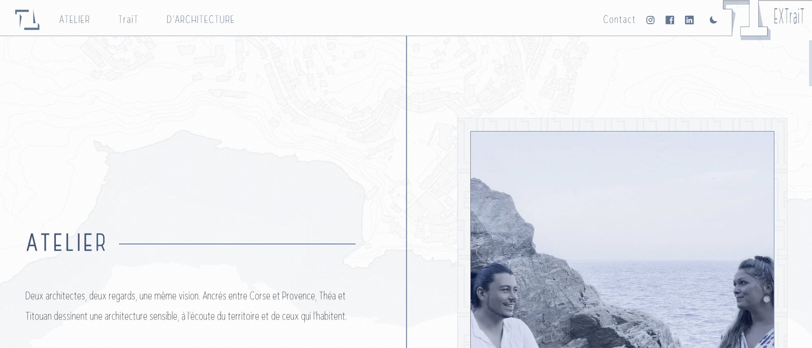

# Atelier Trait d'Architecture — showcase website

Showcase website for an architecture studio, designed and built end to end, in production: **https://trait-darchitecture.vercel.app**



Pro bono project for an architecture studio at launch, based in Corsica and Provence (March–July 2026). I designed and built the whole site — design system, pages, content integration, SEO and deployment — iterating with the two architects from the initial brief to production. The studio provided the content and the visual identity.

## Highlights

- **Astro-first** — every page is pre-rendered static HTML; React 19 is used only for interactive islands (landing, header, galleries, parallax), hydrated lazily with `client:idle` / `client:visible`
- **Typed content** — projects (Markdown) and articles (MDX) live in Astro Content Collections with Zod schemas and validated images; detail pages are generated with `getStaticPaths`
- **Technical SEO** — canonical URLs, Open Graph / Twitter cards, JSON-LD (`Organization`, `WebSite`, `Article`, `CreativeWork`, `ItemList`, `BreadcrumbList`), sitemap, `llms.txt` / `llms-full.txt` generated from the collections at build time, legal notice
- **Images** — responsive `srcset` / `sizes` through `astro:assets`; a post-build script prunes unreferenced originals from `dist/`
- **Performance** — Lighthouse 90+ (performance, accessibility, best practices); self-hosted preloaded fonts, viewport prefetch, Framer Motion loaded through `LazyMotion`
- **Light / dark theme** — `data-theme` on `<html>`, system preference by default, choice kept in `sessionStorage`, applied before first paint and across view transitions (no flash)
- **Accessibility** — semantic HTML, skip link, focus trapping in overlays, live regions for dynamic counters, `prefers-reduced-motion` honoured everywhere
- **Contact form without a backend** — Web3Forms endpoint, honeypot field and minimum fill-time guard

## Stack

Astro 6 · React 19 (islands) · TypeScript (strict) · Tailwind CSS 4 · Framer Motion · OverlayScrollbars · MDX · ESLint · Vercel

## Run locally

Node.js ≥ 22.12 (see `.nvmrc`)

```bash
npm install
npm run dev
```

| Command           | Purpose                                                   |
| ----------------- | --------------------------------------------------------- |
| `npm run dev`     | Astro dev server                                          |
| `npm run build`   | static build, then `postbuild` prunes unreferenced images |
| `npm run preview` | preview the build                                         |
| `npm run lint`    | ESLint                                                    |

The contact form reads `PUBLIC_WEB3FORMS_KEY` from a `.env` file; everything else runs without it.

## Structure

- `src/pages/` — Astro routes, including `architecture/[slug]`, `extrait/[slug]` and the `llms.txt` endpoints
- `src/content/` — Content Collections (`projects`, `articles`), schemas in `src/content.config.ts`
- `src/components/` — Astro components and React islands, grouped by page (`home`, `atelier`, `trait`, `architecture`, `extrait`, `contact`, `legal`) plus shared `ui/`
- `src/layouts/BaseLayout.astro` — `<head>`, SEO metadata, JSON-LD, theme bootstrap
- `src/styles/index.css` — design tokens and global styles
- `scripts/prune-dist-originals.mjs` — post-build image pruning
- `public/` — fonts, favicons, web manifest, `robots.txt`

## Author

Paul Alessandrini — Web developer · [LinkedIn](https://www.linkedin.com/in/paul-alessandrini) · [GitHub](https://github.com/Palalde)
